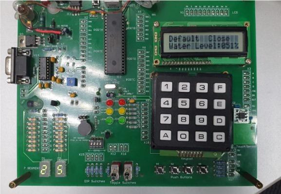
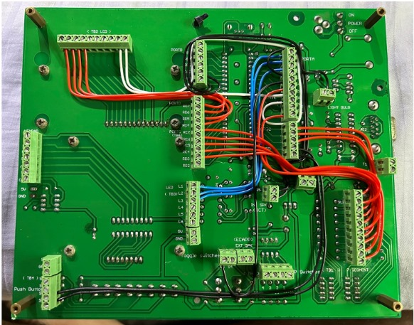
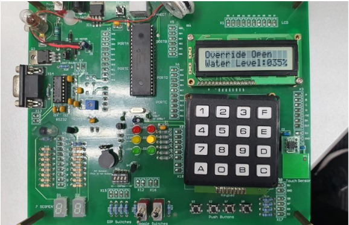

# Hydroelectric-Dam_Proj

## Overview

This project focuses on a hydroelectric dam system that contributes 30% of renewable energy and 7% of the US power supply. The dam plays a crucial role in maintaining a consistent water level and stable electricity generation for a neighboring town.

## Project Description

For this collaborative project, I was tasked with designing a microcontroller-based system for the hydroelectric dam. The system's key functionalities include monitoring temperature, water levels, gate operations, issuing alerts through sound and lights, enabling manual overrides, and autonomously regulating water quality through inflow and exchange control.

## Board Operations

The system emulates the behavior of a hydroelectric dam through real-time monitoring and control. It oversees parameters such as temperature, water levels, and gate statuses. Notable features include:

- Displaying temperature on a 7-segment display.
- Presenting water levels as a percentage on an LCD screen.
- Activating alerts with sound and lighting when water levels reach critical points.
- Allowing manual gate control through button inputs.
- Automating gate opening and closing based on predefined time intervals.

### Microcontroller Visuals

#### Microcontroller Front

#### Microcontroller Back

## Software Features

The software components are developed using a variety of techniques, including:

- Polling of input pins to monitor state changes.
- Utilizing external interrupts to respond to critical events.
- Employing timers to execute specific actions at predefined intervals.
- Conducting analog-to-digital conversion to measure temperature.

## Hardware Components

The hardware components used in this project include:

- LEDs, toggle switches, and push-buttons for user interactions.
- A seven-segment display to visualize temperature.
- A 16x2 LCD for water level presentation.
- A speaker for audio alerts.
- A motor for gate control.
- An LM35 temperature sensor for temperature monitoring.

## Personal Contributions

Throughout the project, I played a part by:

- Implementing the LCD display to showcase incremental water level changes.
- Creating a timer interrupt that manages water level adjustments within specific thresholds.
- Utilizing analog-to-digital conversion to read temperature from the LM35 sensor and display it on the 7-segment display.

### Operational Visuals

#### Normal Operation

#### Manual Operation

